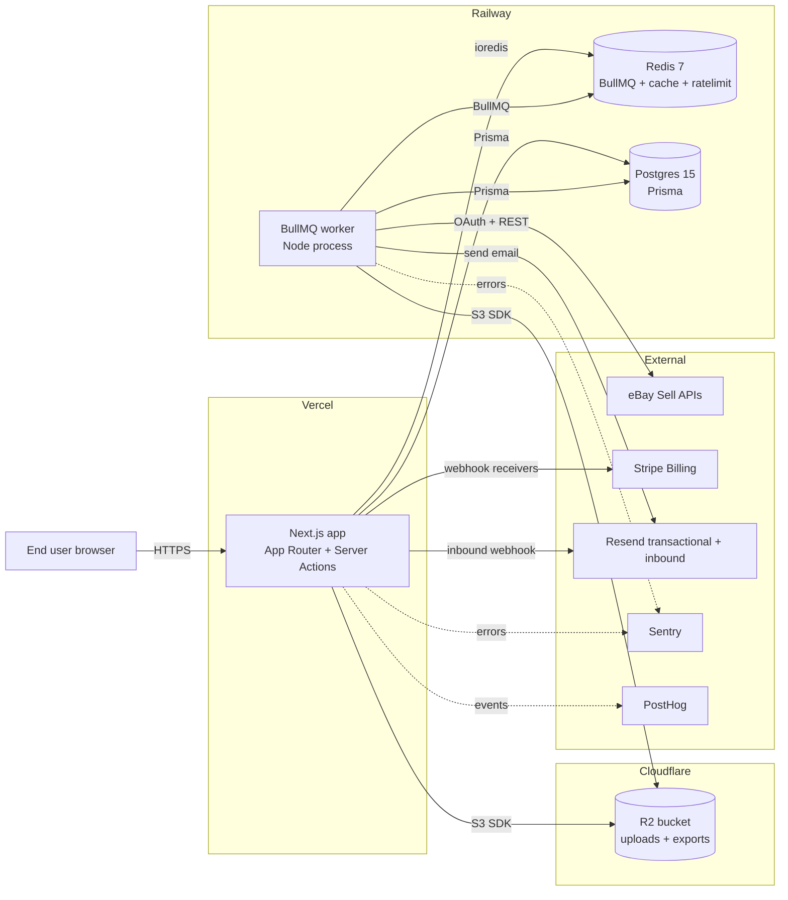
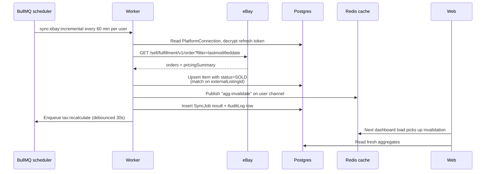
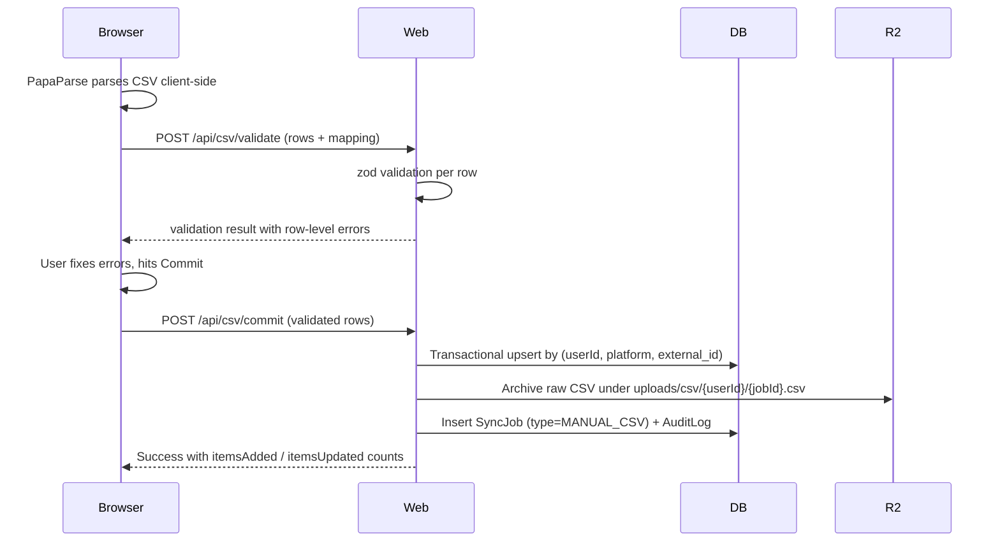
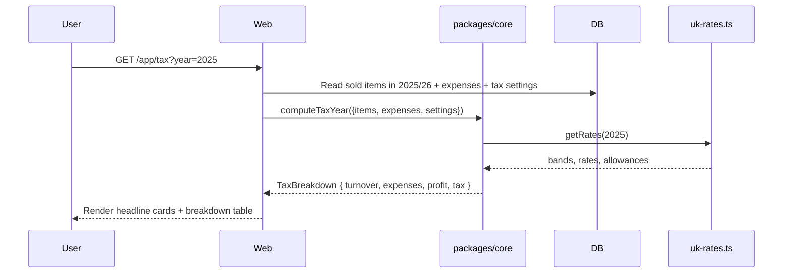
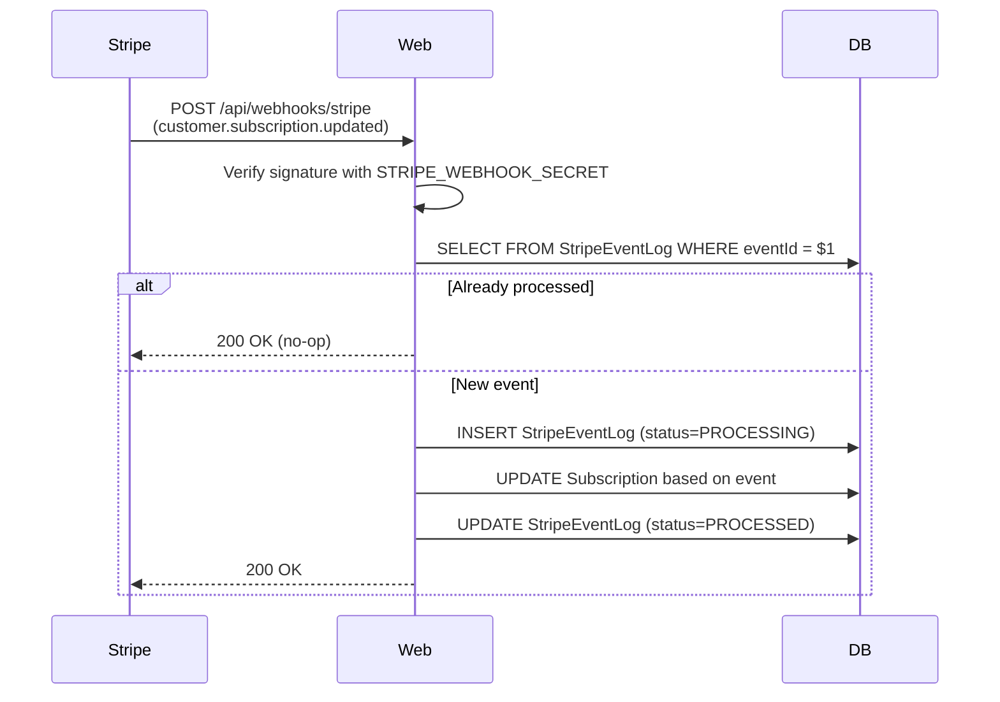
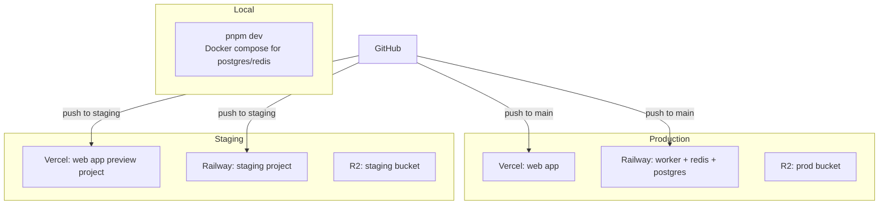

# Architecture

This document describes the runtime shape of LedgerLoop: the processes, the data they hold, the messages they exchange, and where each lives in production. It does not repeat tactical decisions captured in `DECISIONS.md`; it explains the system as a deployed thing.

## 1. High-level topology

LedgerLoop runs as five logical services. Three of them are stateful (Postgres, Redis, R2) and two are stateless application processes (the Next.js web app and the BullMQ worker). The web app and worker share code via the monorepo's packages but run as independent processes with different scaling characteristics.

The split between web and worker matters because eBay imports are minutes-long jobs that cannot live inside a request handler, and weekly digests need a cron-driven scheduler that Vercel does not provide cleanly. Putting both on Railway alongside Postgres and Redis keeps the worker close to its dependencies and gives us a Unix-process environment for long-lived connections.

## 2. Data flow: the four critical paths

The four paths through the system that account for almost all of the business logic. If these are correct, the rest of the product is layout and ergonomics on top.

### 2.1 New sale arriving from eBay

The cache-invalidation hop is the only piece of cross-process communication that matters in real time. Everything else is "the worker writes to Postgres, the web app reads from Postgres." Pubsub via Redis is used purely to drop stale cached aggregates so the dashboard updates within seconds of an eBay sync.

### 2.2 User uploads a Depop CSV

The two-phase validate-then-commit pattern lets us show row-level errors before the user spends bandwidth uploading. Larger uploads (over a configurable threshold) take a third phase: enqueue a `csv:commit` worker job and the web app polls for completion.

### 2.3 Tax page recomputation

The web app is the only caller of `packages/core/src/tax`. The worker triggers `tax:recalculate` jobs for cache warming, but the actual computation is a pure function — given the same items and rates, the answer is identical regardless of where it runs.

### 2.4 Stripe webhook for subscription change

Idempotency is keyed by `event.id`. The `StripeEventLog` table is the single source of truth for "did we process this event already" — never trust the subscription record itself to be enough, because Stripe can deliver events out of order.

## 3. Process responsibilities

### 3.1 Next.js web app (`apps/web`)

The web app holds the user-facing surfaces and the synchronous API. Everything that responds to a click or a page load runs here. Server Actions handle mutations, Route Handlers handle webhooks and signed-URL endpoints, Server Components handle data fetching.

The web app does **not** make outbound calls to eBay. Even though it could — Server Actions are a Node runtime — we keep all platform integration in the worker so that a slow eBay response cannot ever wedge a request handler. The web app talks to Postgres and Redis only.

### 3.2 BullMQ worker (`apps/worker`)

The worker is a single Node process that registers BullMQ workers for each queue. Concurrency is set per queue:

- `sync:ebay:initial` — concurrency 2 (long-running, RAM-heavy)
- `sync:ebay:incremental` — concurrency 10
- `sync:token-refresh` — concurrency 20 (mostly waiting on HTTP)
- `tax:recalculate` — concurrency 10
- `email:digest:weekly` — concurrency 5
- `cleanup:soft-deletes` — concurrency 1 (writes against shared tables)
- `csv:commit` — concurrency 5
- `gdpr:export` — concurrency 2

Repeatable jobs are registered on worker boot, idempotent by job name + cron expression. The worker exposes a `/health` endpoint on port 9091 for Railway's healthcheck.

### 3.3 Postgres (`packages/db`)

Schema is owned by `packages/db/prisma/schema.prisma`. Migrations are generated by Prisma and applied by `pnpm db:migrate`. Backups are Railway's nightly snapshots, retained 30 days, with point-in-time recovery enabled. The `direct_url` and `url` Prisma setting are split so that Prisma Migrate uses a non-pooled connection while the app uses PgBouncer.

Connection pool sizing: 20 connections per web app instance, 30 per worker instance. With Vercel's automatic scaling this can spike — PgBouncer in transaction mode in front of Postgres prevents pool exhaustion.

### 3.4 Redis

Single Redis instance does triple duty: BullMQ queues, the 60-second aggregate cache, and Upstash Ratelimit. Keys are namespaced with prefixes (`bull:`, `agg:`, `rl:`) so a `FLUSHDB` is rare but possible without losing job state if needed.

Persistence is RDB + AOF. We do not treat Redis as durable storage — every important thing it holds is recoverable from Postgres if Redis is lost.

### 3.5 R2 object storage

Three logical prefixes inside one bucket:

- `uploads/receipts/{userId}/{itemId}/{filename}` — expense receipts and item images.
- `uploads/csv/{userId}/{jobId}.csv` — archived CSV uploads, kept 90 days.
- `exports/{userId}/{exportId}.zip` — GDPR exports, signed URL valid 24 hours, hard-deleted after 7 days.

All uploads from the browser go directly to R2 via pre-signed PUT URLs generated by the web app. We never proxy file content through Next.js.

## 4. Deployment topology

Vercel has two projects, one per environment, with their own env vars. Railway has two projects similarly. R2 has two buckets. Stripe has a test mode (used by staging) and live mode (used by production), with separate webhook endpoints registered against each.

Promotion from staging to production is a manual gate: a passing CI run on `main` creates a Vercel preview, and human approval promotes it to the production project. The worker on Railway deploys automatically when `main` updates — there is no parallel "staging worker first" because the worker is harder to roll back and the integration tests run against a worker in the staging environment before merge.

## 5. Boundary contracts

The internal package boundaries enforce architectural intent. Crossing them requires a code review conversation, not a quick refactor.

- `packages/core` has zero runtime dependencies on the rest of the workspace. It can be lifted out and used in a CLI tool or a cron script with no changes. Its only dependencies are decimal.js, date-fns, and zod.
- `packages/platforms` depends only on `packages/core` for shared types. It owns the adapter pattern for each platform: an adapter exposes `connect`, `disconnect`, `importInitial`, `syncIncremental`, `refreshToken`, and returns shape-conforming `Item` records.
- `packages/db` is the only package that imports the Prisma client. `apps/web` and `apps/worker` get a Prisma client via `packages/db`'s export; nobody else may import `@prisma/client` directly.
- `apps/web` and `apps/worker` never import each other. They share via packages.

Violations of these contracts are caught by an eslint rule (`packages/config/eslint.boundaries.cjs`) and fail CI.

## 6. Observability

Three layers:

- **Errors** flow to Sentry. Both web and worker initialise Sentry on boot. Source maps are uploaded by the CI pipeline so stack traces resolve to source.
- **Product analytics** flow to PostHog from the web app only. Event taxonomy is documented in `packages/core/src/analytics/events.ts` — a single source of truth so events are not invented ad-hoc per feature.
- **Logs** are emitted by Pino, structured JSON, shipped to Better Stack (Logtail). Each line includes `userId`, `workspaceId`, `requestId`, `route` as base fields. The retention is 7 days for hot, 30 for warm.

Synthetic monitoring polls `/api/health` (web) and `:9091/health` (worker) every 60 seconds from a Better Stack uptime monitor. Alerts route to email and to a Slack channel if revenue-impact is high (Stripe webhook failures, eBay sync failures across multiple users).

## 7. Capacity assumptions

The product is sized for "a UK reseller making £40k/year of side income." That implies roughly 500-2,000 items per user, 30-100 sales per week, one eBay account, occasional CSV uploads, and a tax recompute about once a week.

Per 1,000 active users:

- Postgres: ~2 GB at year 1 (items, expenses, audit log), growing ~3 GB/year. Single instance with read replica only when needed.
- Redis: <500 MB working set. Single instance.
- Worker: 1 instance comfortably handles all queues with average per-job time under 30s. Scale horizontally if `sync:ebay:incremental` queue depth exceeds 100 for more than 5 minutes.
- Web app: Vercel's edge handles the marketing site; the authenticated app runs on Node functions and scales automatically.

These are starting assumptions. Revisit them when MRR exceeds £10k or active users exceed 2,000.
